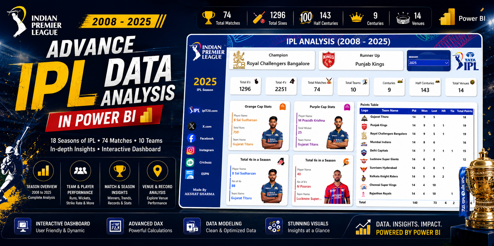
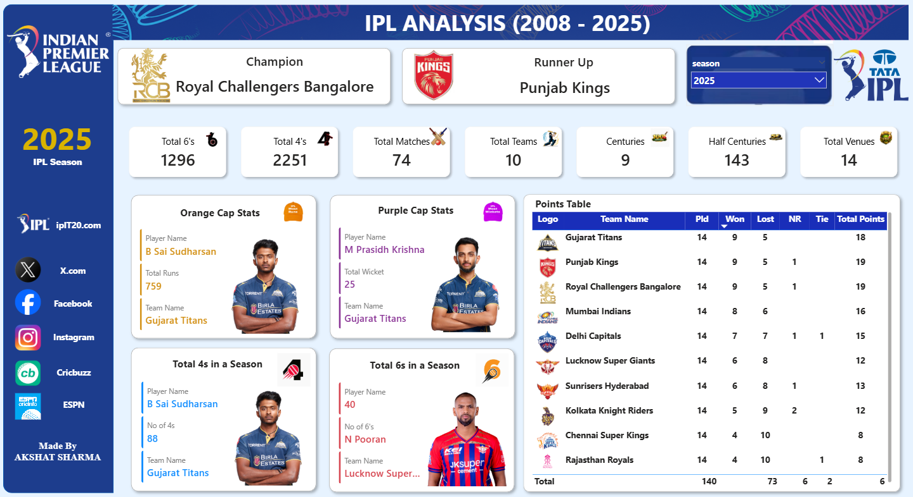

# 🏏 IPL Analysis (2008–2025) | Advanced Power BI Dashboard

<p align="center">
  
</p>

<p align="center">
  
  
  
  
</p>

---

# 📌 Project Overview 

This project is an **Advanced Power BI Dashboard** that analyzes **18 seasons of the Indian Premier League (IPL)** from **2008 to 2025**. The dashboard provides comprehensive insights into team performance, player achievements, match statistics, venue analysis, and season records through interactive visualizations.

The project showcases the use of **Power BI, Power Query, DAX, and Data Modeling** to transform raw cricket data into meaningful insights.

---

# 🎯 Objectives

- 🏏 Analyze IPL seasons from 2008–2025
- 📊 Build an interactive Power BI Dashboard
- 📈 Track team and player performances
- 🏆 Analyze championship and season statistics
- 🎯 Create dynamic KPIs using DAX
- 📍 Visualize venue and match insights

---

# 🛠️ Tech Stack

| Tool | Purpose |
|------|---------|
| 📊 Power BI | Dashboard Development |
| ⚡ Power Query | Data Cleaning & Transformation |
| 🧠 DAX | Measures & Calculated Columns |
| 🗂 Data Modeling | Relationship Building |
| 📄 CSV Files | Dataset |
| 🎨 Power BI Visuals | Interactive Dashboard |

---

# 📊 Dashboard Preview

<p align="center">

</p>

---

# 📁 Dataset Used

The project utilizes four datasets:

### 🏏 IPL Matches Data
- Match ID
- Season
- Venue
- Toss Winner
- Match Winner
- Result
- Team1
- Team2

### 🎯 Ball by Ball Data
- Match ID
- Over
- Ball
- Batter
- Bowler
- Runs
- Wicket
- Extras

### 👤 Players Data
- Player Name
- Team
- Batting Style
- Bowling Style
- Nationality

### 🛡 Teams Data
- Team Name
- Logo
- Short Name

---

# 📈 Dashboard Features

## 🏆 Season Summary

- Champion
- Runner-Up
- Season Selector
- Total Matches
- Total Teams
- Total Venues
- Total 4s
- Total 6s
- Total Centuries
- Total Half Centuries

---

## 🟠 Batting Insights

- Orange Cap Winner
- Most Runs
- Most Fours
- Most Sixes
- Highest Individual Score
- Batting Records

---

## 🟣 Bowling Insights

- Purple Cap Winner
- Most Wickets
- Best Bowling Figures
- Bowling Records

---

## 🏏 Team Performance

- Points Table
- Wins
- Losses
- Net Run Rate
- Team Ranking

---

## 📍 Venue Analysis

- Matches by Venue
- Highest Scoring Grounds
- Winning Trends
- Venue Performance

---

## 📊 Match Analysis

- Season-wise Matches
- Toss Analysis
- Winning Percentage
- Team Comparison

---

# 📌 Key KPIs

✅ Champion Team

✅ Runner-Up

✅ Total Matches

✅ Total Teams

✅ Total Venues

✅ Total 4s

✅ Total 6s

✅ Centuries

✅ Half Centuries

✅ Orange Cap Winner

✅ Purple Cap Winner

---

# ⚡ Power BI Features Used

### 📊 Data Modeling

- Star Schema
- Relationships
- Lookup Tables

---

### ⚡ Power Query

- Data Cleaning
- Data Transformation
- Removing Null Values
- Column Formatting

---

### 🧠 DAX Functions

- CALCULATE()
- SUM()
- COUNTROWS()
- FILTER()
- ALL()
- RANKX()
- DIVIDE()
- MAXX()
- MINX()
- RELATED()
- SWITCH()
- IF()

---

### 📈 Visualizations

- KPI Cards
- Slicers
- Tables
- Matrix
- Bar Charts
- Column Charts
- Pie Charts
- Donut Charts
- Cards
- Images
- Interactive Filters

---

# 📊 Dashboard Insights

🏆 Track IPL Champions across all seasons

🏏 Compare team performances

🎯 Analyze batting and bowling records

📈 View venue-wise statistics

🏅 Discover Orange & Purple Cap winners

📍 Explore match trends over 18 seasons

---

# 🚀 Project Workflow

```
CSV Files
     │
     ▼
Power Query
(Data Cleaning)
     │
     ▼
Data Modeling
(Relationships)
     │
     ▼
DAX Measures
     │
     ▼
Interactive Dashboard
     │
     ▼
Business Insights
```

---

# 💡 Key Learnings

✔ Advanced Power BI

✔ Data Modeling

✔ Power Query

✔ DAX Calculations

✔ Dashboard Design

✔ Sports Data Analytics

✔ Business Intelligence

✔ Interactive Reporting

---

# ⭐ Future Improvements

- 📊 Player Comparison Dashboard
- 🎯 Team vs Team Analysis
- 📍 Win Prediction Analysis
- 🤖 AI Visuals
- 🌍 Live IPL Data Integration
- 📈 Performance Trends

---

# 📬 Connect With Me

**Akshat Sharma**

- 💼 LinkedIn: *(Add Your LinkedIn URL)*
- 💻 GitHub: *(Add Your GitHub URL)*

---

# ⭐ Support

If you found this project helpful, don't forget to **⭐ Star** this repository!

It motivates me to build more data analytics and Power BI projects.

---

## 📜 License

This project is created for **learning and portfolio purposes** only.

© 2026 Akshat Sharma
